## Certifications

Here are some of my certifications to showcase my continuous learning journey:

### 2023/01/21 Google Project Management Foundations

### 2022/12/20 DataCamp Data Scientist
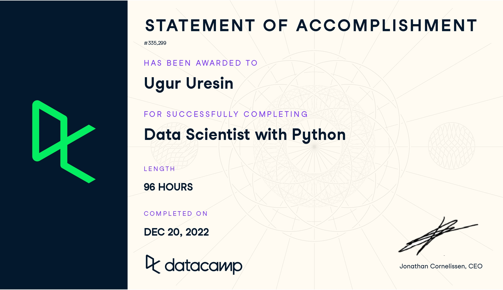

### 2022/03/28 Udacity Azure Machine Learning
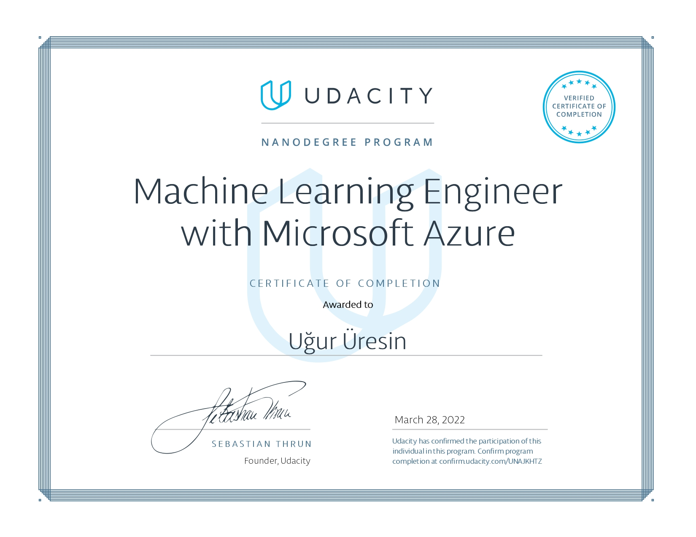

### 2022/04/15 Udemy Software Engineering
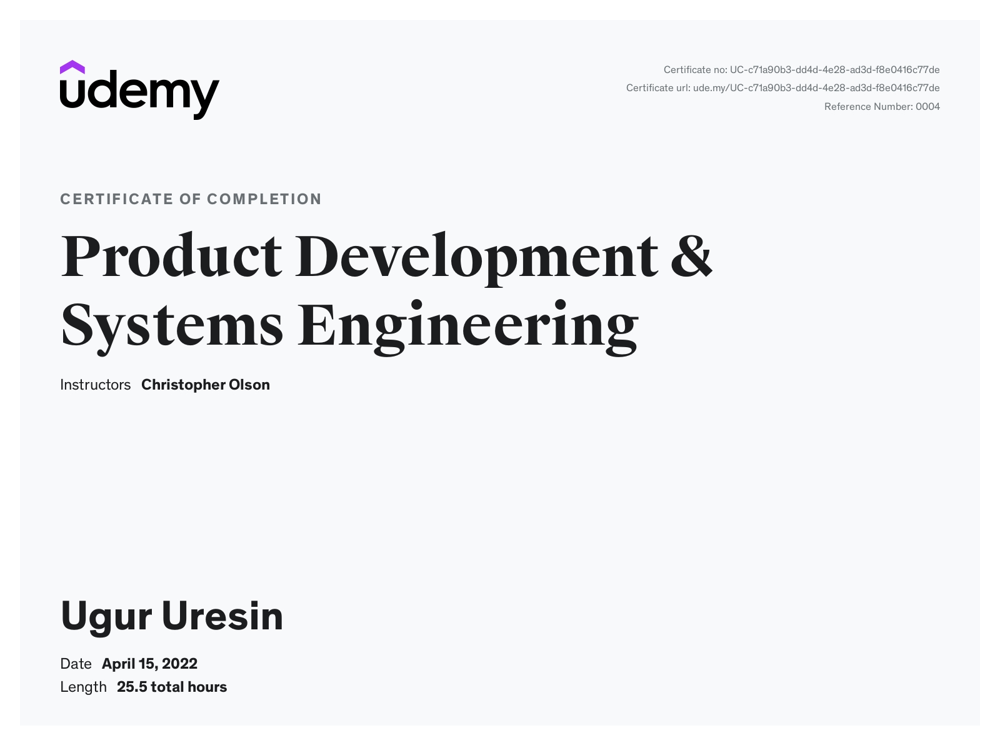

### 2020/12/20 Coursera DeepLearning 5 Courses
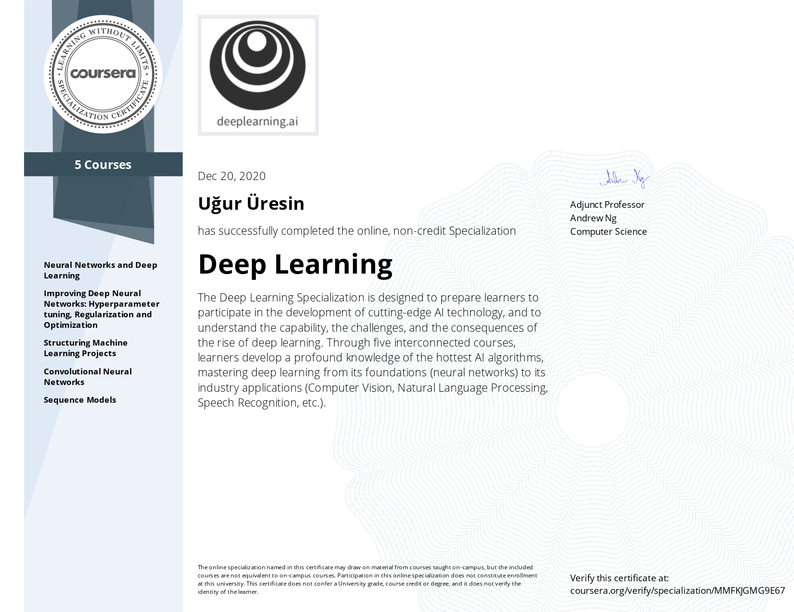

### 2020/12/30 Coursera DeepLearning TF 4 Courses
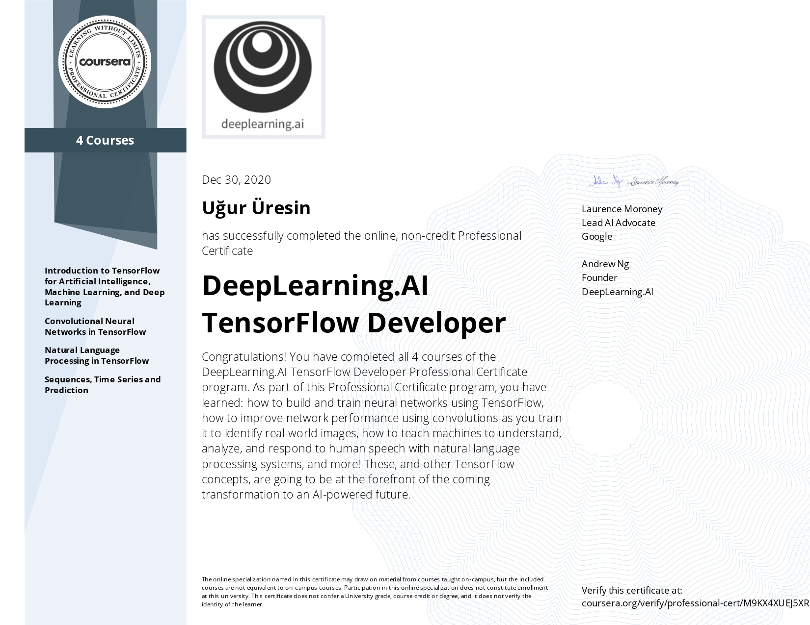

### 2020/12/31 Coursera DeepLearning with PyTorch
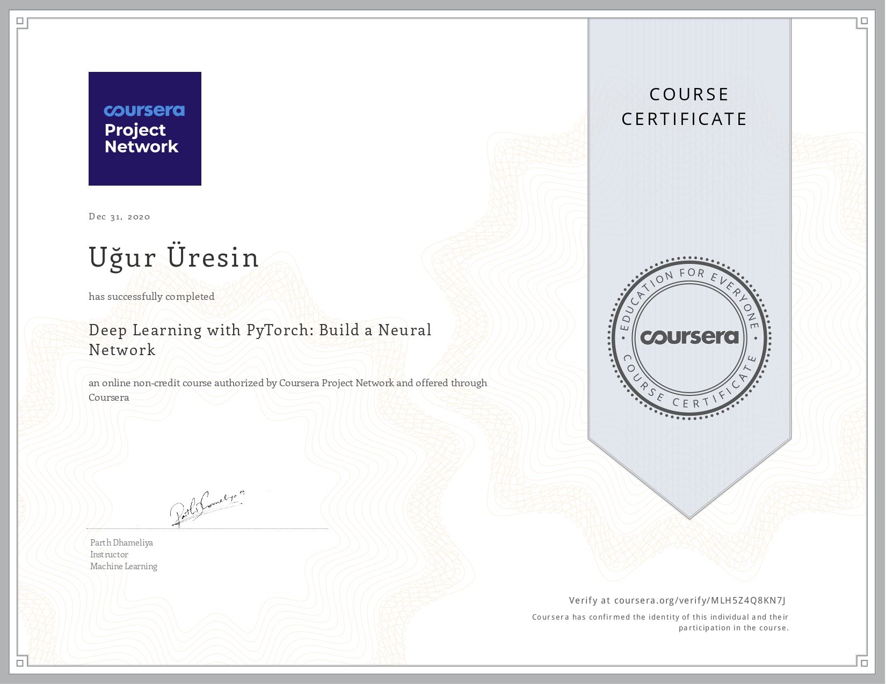

### 2020/09/19 Udacity Self Driving
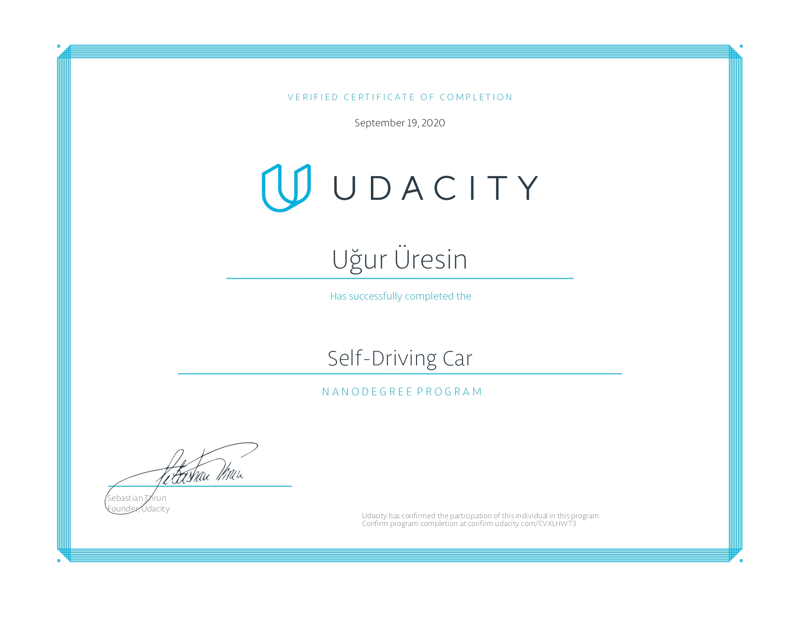

### 2019/08/27 Udacity Data Analyst
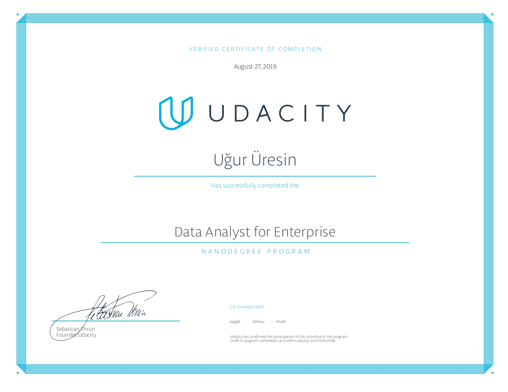

### 2019/07/01 Udemy MachineLearning Python R
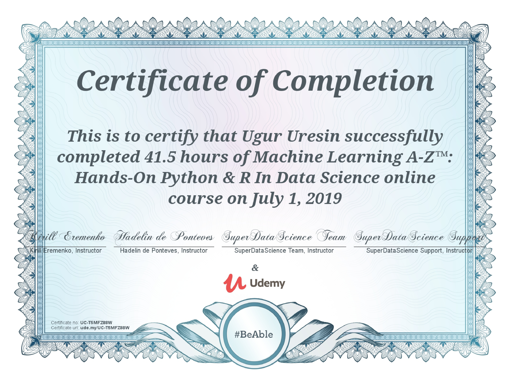

### 2019/01/19 Udemy Python Complete
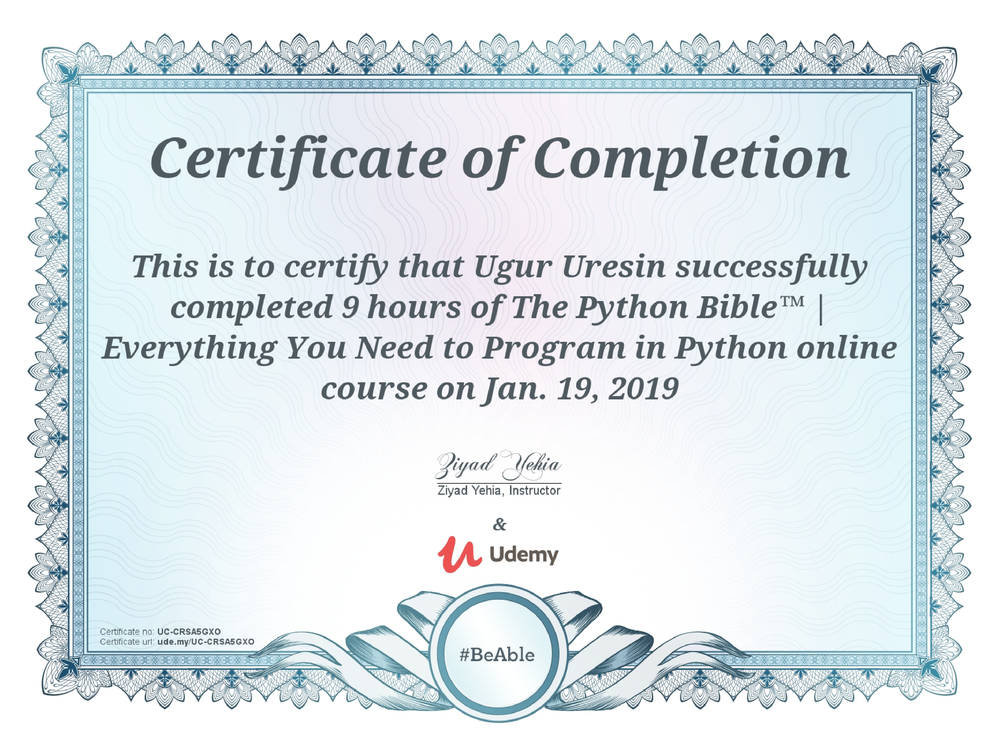

### 2018/10/29 Udemy Advanced Analytics R
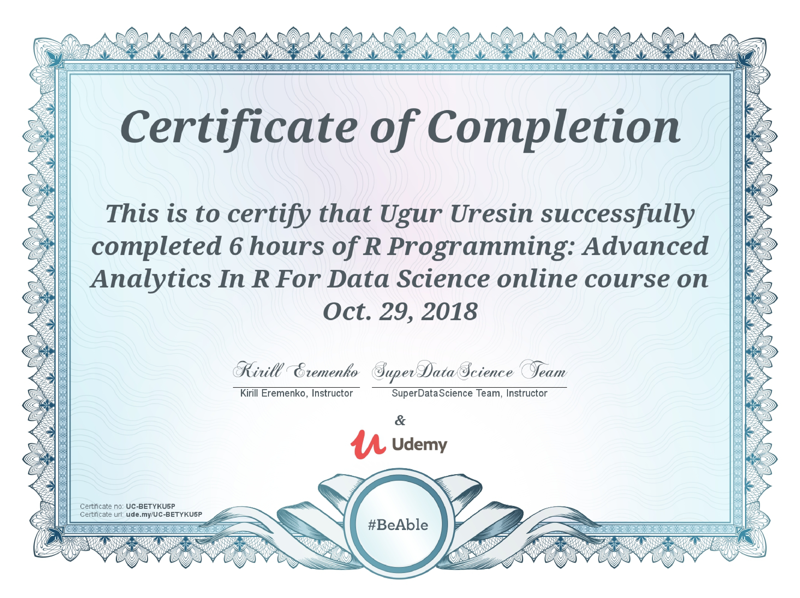
